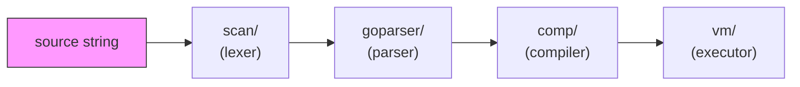
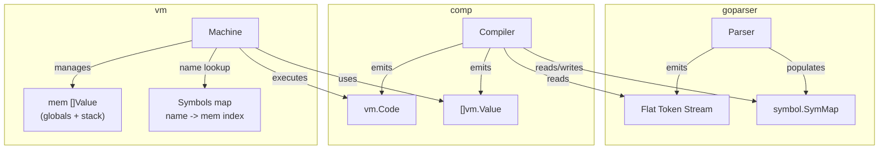

# Architecture Overview

Parscan interprets a subset of Go by piping source code through four stages:
lexing, parsing, compilation, and execution. Each stage is a standalone package
with a clean interface to the next.

## Pipeline



| Stage | Package | Input | Output |
|-------|---------|-------|--------|
| Lex | `scan/` | source string + `lang.Spec` | `[]scan.Token` |
| Parse | `goparser/` | scanner tokens | flat `goparser.Tokens` with Label/Goto/JumpFalse |
| Compile | `comp/` | flat token stream | `[]vm.Instruction` + `[]vm.Value` (data segment) |
| Execute | `vm/` | instructions + data | program output / return value |

The `interp/` package wires these stages together and provides incremental
evaluation (REPL support).

## Data flow



The parser and compiler share a single `symbol.SymMap`. The parser registers
types and function signatures; the compiler resolves addresses and emits
bytecode referencing data indices.

## Memory model

The VM operates on a flat `[]Value` slice:

```
mem[0 .. dataLen-1]   globals (module-level vars, function code addresses)
mem[dataLen ..]       call stack (grows upward)
```

Each call frame is laid out as:

```
[ ... args | deferHead | retIP | prevFP | locals ... ]
                                  ^
                                  fp points here (past deferHead, retIP, prevFP)
```

`frameOverhead = 3` accounts for the three bookkeeping slots. `deferHead`
holds the index of the topmost deferred-call record (0 = none).

A separate `frames []frame` slice tracks per-call metadata (caller closure
env, nret/narg). See [vm](modules/vm.md#call-frame) for details.

- `Get Global N` reads `mem[N]`
- `Get Local N` reads `mem[fp - 1 + N]`

## Key design decisions

1. **No AST** -- the parser emits a flat token stream with control-flow
   encoded as `Label`/`Goto`/`JumpFalse` tokens. This eliminates a tree
   traversal pass and makes code generation a single linear walk.
   See [ADR-001](decisions/ADR-001-flat-token-stream.md).

2. **Hybrid Value** -- `vm.Value` stores numerics inline in a `uint64` field
   and composites in a `reflect.Value`. Arithmetic never allocates.
   See [ADR-002](decisions/ADR-002-hybrid-value.md).

3. **Scope as path** -- scopes are slash-separated strings
   (e.g. `main/foo/for0`), making symbol lookup a prefix walk.
   See [ADR-003](decisions/ADR-003-scope-as-path.md).

4. **Two-phase compilation with pre-allocated slots** -- compilation splits
   into a declaration phase (const, type, var types, func/method signatures)
   and a code generation phase (var initializers first, then func bodies).
   Phase 1 uses a retry loop for forward references; Phase 2 pre-allocates
   data slots and uses topological sorting of var declarations to eliminate
   retries entirely. See [ADR-004](decisions/ADR-004-lazy-fixpoint.md).

5. **Per-type opcodes** -- 12 numeric type variants for arithmetic ops,
   plus immediate-operand variants that fold `Push+BinOp` into one instruction.
   See [ADR-005](decisions/ADR-005-per-type-opcodes.md).

6. **Native Go interop** -- parscan functions are wrapped via `WrapFunc`
   and `reflect.MakeFunc` to be callable from native Go code. A `funcFields`
   side-table handles assignment to typed struct func fields.
   See [ADR-006](decisions/ADR-006-native-func-interop.md).

## Closure and interface dispatch

Closures capture variables via heap cells (`Closure{Code, Env}`). Opcodes
`HAlloc`, `HGet`, `HSet`, `HPtr`, and `MkClosure` manage the capture
environment.

Interface dispatch uses an `Iface` wrapper holding a concrete type and value.
Methods are identified by integer IDs (`methodIDs` in the compiler).
`IfaceWrap` boxes a value; `IfaceCall` dispatches by method ID.

## Variadic functions

Variadic parameters (`...T`) are parsed as `[]T` by `goparser`. At the call
site, the compiler emits `MkSlice` to pack trailing arguments into a slice
before `Call`. The callee sees a normal slice parameter.

## Built-in functions

Go builtins (`len`, `cap`, `append`, `copy`, `delete`, `new`, `make`,
`panic`, `recover`) and the parscan-specific `trap` debugger builtin are
registered in `symbol.SymMap` with `Kind: Builtin`.
The compiler intercepts them by name in `compileBuiltin()` and emits
dedicated opcodes rather than generating a function call. Because `Builtin`
symbols skip the `Get` instruction in the `Ident` handler, they have no
runtime value on the VM stack -- the compiler emits only the opcode that
performs the operation.

## Exception handling

`panic` sets a flag and unwinds the call stack. `defer` pushes a sentinel
frame with a `DeferRet` handler. `recover` clears the panic state inside a
deferred function.

## Debug / trap support

Parscan provides an in-process debugger triggered by `trap()`, a builtin
that compiles to the `Trap` opcode. When the VM hits `Trap`, it pauses
execution and drops into an interactive REPL where the user can inspect the
call stack and memory.

The mechanism reuses the run loop's sentinel-IP pattern (the same approach
used by `defer` and `panic` unwinding): `Trap` saves the resume address and
sets `ip` to a special constant (`trapIP = -3`). The outer loop detects
this sentinel and calls `enterDebug()`.

Debug info (symbol names, source positions) is built lazily -- the
interpreter registers a builder function on the VM, and it is only called
when the first `trap()` fires. This avoids overhead for programs that never
use `trap`.

See [vm](modules/vm.md#trap-and-interactive-debug-mode) for implementation
details.
