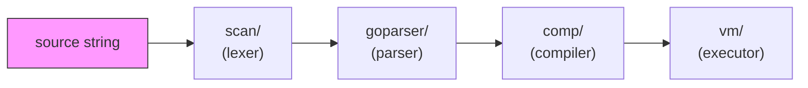
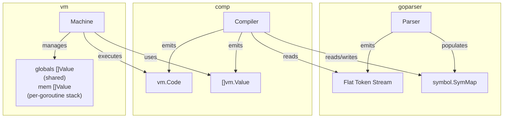

# Architecture Overview

Parscan interprets a subset of Go by piping source code through four stages:
lexing, parsing, compilation, and execution. Each stage is a standalone package
with a clean interface to the next.

## Pipeline



| Stage | Package | Input | Output |
|-------|---------|-------|--------|
| Lex | `scan/` | source string + `lang.Spec` | `[]scan.Token` |
| Parse | `goparser/` | scanner tokens | flat `goparser.Tokens` with Label/Goto/JumpFalse |
| Compile | `comp/` | flat token stream | `[]vm.Instruction` + `[]vm.Value` (data segment) |
| Execute | `vm/` | instructions + data | program output / return value |

The `interp/` package wires these stages together and provides incremental
evaluation (REPL support).

## Data flow



The parser and compiler share a single `symbol.SymMap`. The parser registers
types and function signatures; the compiler resolves addresses and emits
bytecode referencing data indices.

## Memory model

The VM maintains two separate slices:

```
globals[0 .. dataLen-1]   global variable storage (module-level vars, func addresses)
mem[0 ..]                 call stack (grows upward; frame-relative indices only)
```

The split exists so that goroutines can share `globals` safely while each
goroutine runs its own private `mem` stack. Before the split, both lived in a
single `mem` slice, which made goroutine isolation impossible without copying.

Each call frame is laid out as:

```
[ ... args | deferHead | retIP | prevFP | locals ... ]
                                  ^
                                  fp points here (past deferHead, retIP, prevFP)
```

`frameOverhead = 3` accounts for the three bookkeeping slots:

- `deferHead` -- index of the topmost deferred-call record (0 = none).
- `retIP` -- packed `uint64`: `[frameBase:16 | nret:16 | retIP:32]`.
  Encodes the return address, number of return values, and frame size
  in a single slot, avoiding a separate metadata structure.
- `prevFP` -- the caller's frame pointer. The high bit (`heapSavedFlag`)
  indicates whether the caller's closure heap was saved to `heapFrames`.

A side-channel `heapFrames [][]*Value` slice saves caller closure heaps.
An entry is pushed only when the caller has a non-nil `heap` (closure calls);
plain function calls skip it entirely.
See [vm](modules/vm.md#call-frame) for details.

- `GetGlobal N` reads `globals[N]`
- `GetLocal N` reads `mem[fp - 1 + N]`

## Key design decisions

1. **No AST** -- the parser emits a flat token stream with control-flow
   encoded as `Label`/`Goto`/`JumpFalse` tokens. This eliminates a tree
   traversal pass and makes code generation a single linear walk.
   See [ADR-001](decisions/ADR-001-flat-token-stream.md).

2. **Hybrid Value** -- `vm.Value` stores numerics inline in a `uint64` field
   and composites in a `reflect.Value`. Arithmetic never allocates.
   See [ADR-002](decisions/ADR-002-hybrid-value.md).

3. **Scope as path** -- scopes are slash-separated strings
   (e.g. `main/foo/for0`), making symbol lookup a prefix walk.
   See [ADR-003](decisions/ADR-003-scope-as-path.md).

4. **Two-phase compilation with pre-allocated slots** -- compilation splits
   into a declaration phase and a code generation phase. Phase 1
   (declarations, retry loop, struct placeholders) lives in
   `goparser.ParseAll`; Phase 2 (code generation with pre-allocated data
   slots) lives in `comp.Compile`. Phase 1 uses a retry loop for forward
   references; Phase 2 uses topological sorting of var declarations to
   eliminate retries entirely. See [ADR-004](decisions/ADR-004-lazy-fixpoint.md).

5. **Per-type opcodes** -- all arithmetic opcodes are statically typed;
   there are no generic `Add`/`Sub`/`Mul`/`Neg`/`Greater`/`Lower` opcodes.
   12 numeric type variants per operation are selected at compile time via
   `NumKindOffset`. String concatenation uses the separate `AddStr` opcode.
   Immediate-operand variants fold `Push+BinOp` into one instruction.
   See [ADR-005](decisions/ADR-005-per-type-opcodes.md).

6. **Super instructions** -- the compiler fuses common multi-instruction
   sequences into single opcodes to reduce dispatch overhead. Three levels
   of fusion: `GetLocal+Op+Imm` (e.g. `GetLocalAddIntImm`),
   `Compare+Jump` (e.g. `LowerIntImmJumpFalse`), and triple fusion
   `GetLocal+Compare+Jump` (e.g. `GetLocalLowerIntImmJumpFalse`).
   See [ADR-007](decisions/ADR-007-super-instructions.md).

7. **Native Go interop** -- parscan functions are wrapped via `WrapFunc`
   and `reflect.MakeFunc` to be callable from native Go code. A `funcFields`
   side-table handles assignment to typed struct func fields.
   See [ADR-006](decisions/ADR-006-native-func-interop.md).

8. **Flat instruction encoding** -- `Instruction` is a fixed-size 16-byte
   struct `{Op Op; A, B int32; Pos Pos}` with two inline operands.
   This avoids heap-allocating an `[]int` arg slice per instruction and
   improves cache locality in the dispatch loop.

9. **Generics via monomorphization** -- generic functions and types are
   stored as token-level templates. Each instantiation (`Max[int]`,
   `Box[string]`) produces a specialized copy by textual substitution,
   then parses it through the normal path. No runtime type parameters,
   no new opcodes. See [ADR-011](decisions/ADR-011-generics-monomorphization.md).

## Closure and interface dispatch

Closures capture variables via heap cells (`Closure{Code, Heap}`). Opcodes
`HeapAlloc`, `HeapGet`, `HeapSet`, `HeapPtr`, and `MkClosure` manage the capture
environment.

Interface dispatch uses an `Iface` wrapper holding a concrete type and value.
Methods are identified by integer IDs (`methodIDs` in the compiler).
`IfaceWrap` boxes a value; `IfaceCall` dispatches by method ID.

## Interface bridging for native Go calls

Go's `reflect.StructOf` cannot register methods on dynamically-created types.
When an interpreted value with methods (e.g. `String() string`) is passed to a
native Go function like `fmt.Println`, Go's interface dispatcher cannot find the
method. Parscan solves this with two complementary dispatch paths at the
native-call boundary:

1. **Interface bridges** -- single-method (and composite / multi-method)
   wrappers that let interpreted values satisfy a Go interface in place.
   Four families live in `vm/bridge.go`: `Bridges`, `DisplayBridges`,
   `CompositeBridges`, `InterfaceBridges`. Bridge type definitions live in
   `stdlib/` and register themselves at init. Adding a new bridge requires
   no changes to `vm/` or `comp/`. See
   [ADR-009](decisions/ADR-009-interface-bridging.md).

2. **Argument proxies** -- full-`Iface` wrappers that hand a parscan-native
   shadow package (e.g. `stdlib/jsonx`) the original parscan type metadata.
   Used when the native code walks struct fields via reflection and a
   single-method bridge on the top argument is not enough. Registered via
   `vm.RegisterArgProxy` / `RegisterArgProxyMethod`; shadows also overlay
   their replacement types via `stdlib.RegisterPackagePatcher`. See
   [ADR-012](decisions/ADR-012-package-patchers-arg-proxies.md).

The compiler emits `IfaceWrap` for arguments to native function calls with
interface parameters, carrying the parscan `*Type` identity across the
boundary (essential for non-struct named types where the `reflect.Type` is
shared with the underlying type). `bridgeArgs` in `vm.Run` checks arg
proxies first, then the bridge families, then unwraps.

## Variadic functions

Variadic parameters (`...T`) are parsed as `[]T` by `goparser`. At the call
site, the compiler emits `MkSlice` to pack trailing arguments into a slice
before `Call`. The callee sees a normal slice parameter.

## Built-in functions

Go builtins (`len`, `cap`, `append`, `copy`, `delete`, `new`, `make`,
`close`, `panic`, `recover`) and the parscan-specific `trap` debugger builtin
are registered in `symbol.SymMap` with `Kind: Builtin`.
The compiler intercepts them by name in `compileBuiltin()` and emits
dedicated opcodes rather than generating a function call. Because `Builtin`
symbols skip the `Get` instruction in the `Ident` handler, they have no
runtime value on the VM stack -- the compiler emits only the opcode that
performs the operation.

## Exception handling

`panic` sets a flag and unwinds the call stack. `defer` pushes a sentinel
frame with a `DeferRet` handler. `recover` clears the panic state inside a
deferred function.

## Debug / trap support

Parscan provides an in-process debugger triggered by `trap()`, a builtin
that compiles to the `Trap` opcode. When the VM hits `Trap`, it pauses
execution and drops into an interactive REPL where the user can inspect the
call stack and memory.

The `Trap` opcode saves the resume address, syncs Machine state, and calls
`enterDebug()` inline. Defer return and panic unwinding use sentinel opcodes
(`DeferRet`, `PanicUnwind`) appended to the code array at `Run` entry.

Debug info (symbol names, source positions) is built lazily -- the
interpreter registers a builder function on the VM, and it is only called
when the first `trap()` fires. This avoids overhead for programs that never
use `trap`.

See [vm](modules/vm.md#trap-and-interactive-debug-mode) for implementation
details.
