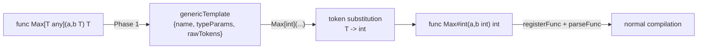

# goparser

> Go parser producing a flat token stream with control flow encoded as
> Label/Goto/JumpFalse -- no AST.

## Overview

The `goparser` package takes scanner tokens and produces a flat `Tokens`
slice suitable for single-pass code generation. It performs scope tracking,
type resolution, and expression rewriting (infix to postfix). It is the
most complex stage in the pipeline.

## Key types and functions

- **`Parser`** -- embeds `*scan.Scanner` and a `symbol.SymMap`. Holds a
  `Packages` map (`map[string]*symbol.Package`) for imported packages
  and a `pkgfs` filesystem for reading imported source files. Tracks the
  current scope path, break/continue labels, closure state, and named
  return variables.
- **`Token`** -- extends `scan.Token` with an `Arg []any` field for
  label targets, type info, etc.
- **`Tokens`** -- slice of `Token` with helper methods (`Index`, `Split`,
  `SplitStart`).
- **`Parse(src string) (Tokens, error)`** -- full parse: scan, then
  parse all statements into a postfix token stream.
- **`ParseAll(name, src string) ([]Tokens, error)`** -- top-level entry
  point for multi-file compilation. If `src` is empty and `name` is a
  directory, reads all `.go` files (excluding `_test.go`) from it via
  `pkgfs`. Runs Phase 1 (declaration resolution with retry loop) and
  returns remaining declarations for Phase 2 code generation. Also
  handles `import` statements by recursively calling itself for
  dependencies.
- **`ImportPackageValues(m map[string]map[string]reflect.Value)`** --
  populates `Packages` with binary (native Go) package values, using
  `symbol.BinPkg` to wrap them.
- **`SetPkgfs(pkgPath string)`** -- sets the parser's virtual filesystem
  for resolving imported source packages.
- **`ParseDecl(toks Tokens) (handled bool, err error)`** -- resolve a
  single declaration during Phase 1 without emitting code. Delegates to
  `parsePackage`, `parseImports`, `parseConst`, `parseType`,
  `registerFunc`, or `parseVarDecl`. Returns `handled=false` when the
  declaration needs full parse + code generation (func bodies, var
  initializers).
- **`ParseOneStmt(toks Tokens) (Tokens, error)`** -- parse a single
  statement (used during compilation phase 2).
- **`registerFunc(toks Tokens) error`** -- register a function or method
  signature in the symbol table without parsing its body. For methods
  (`func (recv) Name(...)`), extracts the receiver type via
  `recvTypeName` and registers under `TypeName.MethodName`. Caches
  parameter names in the `Type` and receiver variable name in
  `Symbol.RecvName` so `parseFunc` can skip re-parsing the signature.
  Parses in `typeOnly` mode to suppress parameter symbol registration.
  Generic functions (`func Name[T any](...)`) are detected here and
  stored as `symbol.Generic` templates instead of being parsed immediately.
- **`SplitAndSortVarDecls(decls []Tokens) []Tokens`** -- expands
  `var(...)` blocks into individual declarations and topologically sorts
  them by dependency (references between var initializers). Non-var
  declarations keep their original positions.
- **`recvTypeName(recvr Tokens) string`** -- extracts the type name from
  scanned receiver tokens (e.g. `"T"` from `(t T)`, `"*T"` from
  `(t *T)`).

### Error types

- **`ErrUndefined{Name}`** -- symbol not yet defined. The compiler catches
  this to trigger retry during Phase 1 declaration resolution.

## Internal design

### Expression parsing

`parseExpr` converts infix expressions to postfix using a shunting-yard
algorithm. Operator precedence and associativity come from `lang.TokenProps`.

Binary operators are left-associative: when a binary operator `op` is pushed
onto the operator stack, the shunting-yard loop flushes all pending operators
with precedence `>= prec(op)` before pushing `op`. Unary operators flush only
`> prec(op)`, making them right-associative.

A token preceded by a colon (e.g. in composite literals) is treated as a unary
context, so that `&` or `*` there is not misclassified as binary.

### Control flow encoding

Instead of building an AST, control structures are lowered to
`Label`/`Goto`/`JumpFalse` tokens:

```
if cond { body }
-->  cond, JumpFalse(L1), body..., Label(L1)

for init; cond; post { body }
-->  init, Label(L0), cond, JumpFalse(L1), body..., post, Goto(L0), Label(L1)
```

Labels are scoped and auto-numbered (e.g. `for0`, `if1`) via `labelCount`.

### Scope tracking

Scopes are slash-separated paths pushed/popped as the parser enters/leaves
blocks. The scope path is used as a prefix key in `symbol.SymMap`.

Bare braced blocks (`{ ... }` as a statement, not controlled by `if`,
`for`, or `switch`) are supported as anonymous nested scopes. `parseStmt`
detects a leading `BraceBlock` token, pushes a synthetic `block<n>` scope
label, parses the block body, then pops the scope on exit. This matches Go
semantics for variable shadowing inside bare blocks.

### Goroutine and channel syntax

**`go` statements.** `parseGo` validates that the statement is
`go expr(args)` -- it requires the last token of the function expression
to be a `ParenBlock`. It parses the callee expression with `parseExpr`,
then the argument block with `parseBlock`, and appends a `lang.Go{narg}`
token. The resulting token stream mirrors the shape of a call statement
and is handled symmetrically by the compiler.

**Channel send statements.** `parseStmt` detects `<-` with a positive
index before any `=` or `:=`, which unambiguously identifies a send
statement. It calls `parseChanSend(in, arrowIdx)`, which parses the
channel expression and value expression separately and appends a
`lang.ChanSend` token.

**Unary channel receive.** In `parseExpr`, `lang.Arrow` (`<-`) is
treated as a unary prefix operator with precedence 6 (equal to unary
minus). In a two-result assignment (`v, ok := <-ch`), `parseAssign`
sets `t.Arg[0] = 1` on the trailing `Arrow` token to signal the ok-form
to the compiler.

**Channel types.** `parseTypeExpr` handles `chan T` by recursively
calling itself for the element type and constructing a `vm.ChanOf` type.
Directional channels (`chan<-`, `<-chan`) are syntactically accepted but
mapped to bidirectional channels.

### Closure analysis

When a function literal references a variable from an outer scope, the
parser marks that variable as `Captured` and records it in `FreeVars`.
This drives `HeapAlloc`/`HeapGet`/`HeapSet` emission during compilation.

### Method registration and receiver handling

`registerFunc` (Phase 1) and `parseFunc` (Phase 2) both handle methods.

In Phase 1, `registerFunc` detects the receiver `ParenBlock` before the
method name, scans it, and calls `recvTypeName` to extract the type name
(handling both value and pointer receivers). The method is registered under
`TypeName.MethodName` in the symbol table.

In Phase 2, `parseFunc` parses the full method body. A subtlety: calling
`parseParamTypes` on the receiver block registers a `LocalVar` symbol at
the outer scope, which may clobber an existing global symbol with the same
name. `parseFunc` saves the original symbol (`savedRecvOuter`) before
parsing, copies the receiver symbol into the function scope, then restores
(or deletes) the outer-scope entry.

### Variadic parameters

`parseParamTypes` detects `...T` syntax (the `Ellipsis` token) and converts
it to a `[]T` slice type, setting a `variadic` flag. This flag propagates
through `FuncOf` so the compiler knows to pack trailing arguments at the
call site.

### Package and import handling

Import resolution lives in `import.go`. `ParseAll` is the main entry point:

1. If `src` is empty and `name` is a directory, reads all `.go` files from
   `pkgfs` (excluding `_test.go` and subdirectories).
2. Calls `scanDecls` (unexported) to split source into top-level declaration
   groups without parsing bodies.
3. Runs `preRegisterStructTypes` to insert placeholder `*vm.Type` entries
   for struct type definitions, enabling forward and mutual type references
   (e.g. `type F func(*A); type A struct{F}`).
4. Enters the Phase 1 retry loop: each declaration is passed to `ParseDecl`.
   Failures with `ErrUndefined` are retried until convergence; rollback is
   lightweight (only `SymTracker` keys are deleted).
5. Returns the remaining declarations (func bodies, var initializers) after
   running `SplitAndSortVarDecls`.

`importSrc` handles `import` statements by calling `ParseAll` recursively
for the imported package path.

## Dependencies

- `scan/` -- scanner tokens.
- `lang/` -- token types, `Spec`.
- `symbol/` -- symbol table, `Package`.
- `vm/` -- `Type`, `Value` (for symbol metadata).
- `io/fs` -- virtual filesystem for imported sources.

### Generics (monomorphization)

Generic functions and types are supported via compile-time monomorphization.
A generic declaration is stored as a token-level template; each use with
concrete type arguments produces a specialized copy by textual substitution.
No new VM opcodes are needed -- the instantiated code is indistinguishable
from hand-written non-generic code.



**Registration.** During Phase 1, `registerFunc` and `parseTypeLine` detect
a `BracketBlock` after the name, call `parseTypeParamList` to extract the
parameter names and constraints, and register the symbol with
`Kind: symbol.Generic`. The raw token slice is stored in `Symbol.Data` as a
`*genericTemplate`. No compilation happens at this point.

`parseTypeParamList` requires the constraint to start with an identifier
(`any`, `comparable`, an interface name). This disambiguates generic types
from array declarations like `type T [3]int` where the bracket contains a
numeric expression.

**Instantiation.** When the parser encounters `Name[TypeArgs]` in an
expression (`parseExpr`) or type context (`parseTypeExpr`), it resolves the
concrete types, calls `instantiate` to produce a rewritten token stream
(substituting type param names, removing the bracket block, renaming to a
mangled name like `Max#int`), and parses the result through the normal
function or type path. Already-instantiated combinations are detected by
symbol table lookup and skipped.

`ensureTypeInstantiated` is a convenience wrapper for type templates: it
resolves type arguments, instantiates, and registers the concrete type in
the symbol table at package scope.

**Mangled names.** `mangledName` produces `Base#Type1#Type2` strings. These
are internal symbol table keys; user code always references the generic name
with explicit type arguments.

**Limitations.** Constraints are stored but not enforced at instantiation
time. Generic methods on generic receiver types are not yet supported.
See [ADR-011](../decisions/ADR-011-generics-monomorphization.md).

## Open questions / TODOs

- Constraint enforcement at instantiation time.
- Generic methods: `func (b Box[T]) Get() T`.
- Nested generics: a generic type used as a field of another generic type.
