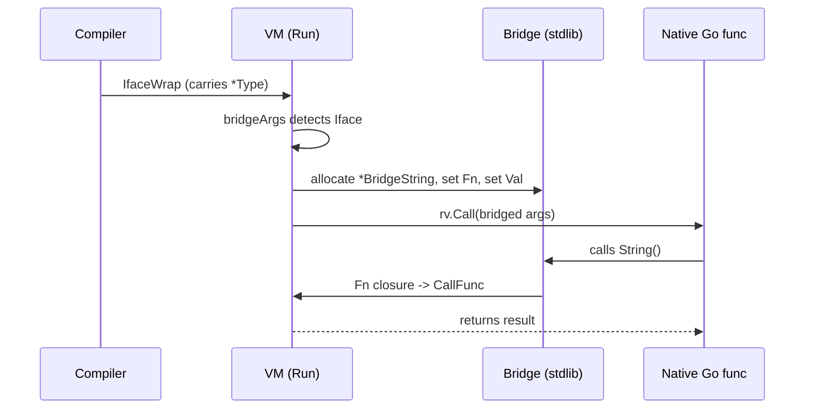

# vm

> Stack-based bytecode virtual machine.

## Overview

The `vm` package executes compiled bytecode. `Machine.Run()` interprets a
`Code` (slice of `Instruction`) over two separate slices: `globals []Value`
(module-level vars and function addresses, shared across goroutines) and
`mem []Value` (the per-goroutine call stack). The package also defines
`Value` (the runtime value representation) and `Type` (runtime type
metadata).

## Key types and functions

### Execution

- **`Machine`** -- VM state: `code`, `globals []Value` (shared with child
  goroutines), `mem []Value` (per-goroutine call stack), `ip`, `fp`,
  closure `heap`, a `heapFrames [][]*Value` stack (saved caller closure heaps,
  pushed only for closure calls where `heap != nil`), panic state
  (`panicking`, `panicVal`), goroutine state (`wg *sync.WaitGroup`,
  `isGoroutine bool`), two func-field side-tables (`funcFields` keyed by
  reflect.Value address, `funcFieldsByFuncPtr` keyed by the closure's
  function pointer -- used as a stable fallback when a struct containing
  func fields is copied e.g. via `append`), and debug state.
- **`Run() error`** -- main execution loop. Dispatches on `Op` via a
  switch statement.
- **`Push(vals ...Value)`** -- append values to `globals` (used before
  `Run` to load the data segment). Returns the start index.
- **`PushCode(instrs ...Instruction)`** -- append instructions (for
  incremental evaluation).

### Values

- **`Value`** -- hybrid runtime value:
  - `num uint64` -- inline storage for numeric types (bool, int*, uint*,
    float*). Holds raw bits.
  - `ref reflect.Value` -- composite data (string, slice, map, struct,
    func) or type metadata for numerics.
  - Variable slots (from `NewValue`): `ref` is addressable.
  - Temporaries (from arithmetic): `ref` is `reflect.Zero(typ)`,
    non-addressable; `num` is canonical.
- **`NewValue(reflect.Type) Value`** -- allocate a zero value (addressable).
- **`ValueOf(any) Value`** -- wrap a Go value.

### Types

- **`Type`** -- runtime type: `Rtype reflect.Type`, `Name`, `PkgPath`,
  `Methods []Method`, `IfaceMethods []IfaceMethod`,
  `Embedded []EmbeddedField`, `Params []*Type`, `Returns []*Type`,
  `Fields []*Type`, `ElemType *Type`.
  `ElemType` preserves the parscan-level element type for
  map/slice/array/pointer/chan composites, propagated by `PointerTo`,
  `ArrayOf`, `SliceOf`, `MapOf`, and `ChanOf`. `Elem()` returns
  `ElemType` when set, falling back to a bare `reflect.Type` wrapper.
- **`(*Type).SameAs(u *Type) bool`** -- reports whether two types
  represent the same concrete type (same `Rtype` and `Name`). Used by
  `TypeBranch` for type-switch comparison and by `TypeAssert`.
- **`(*Type).ReturnType(i int) *Type`** -- returns the parscan-level
  i'th return type from `Returns` if available, else falls back to
  `Out(i)` (reflect-level). Preserves interface method metadata for
  multi-return functions.
- **`Iface{Typ *Type, Val Value}`** -- boxed interface value.
- **`Closure{Code int, Heap []*Value}`** -- captured function.
- **`SelectCaseInfo`** -- describes one case of a `select` statement:
  `Dir reflect.SelectDir` (Send/Recv/Default), `Slot`/`OkSlot` (memory
  indices for received value and ok bool, -1 if unused), `Local bool`
  (true if slots are frame-relative rather than global).
- **`SelectMeta`** -- compile-time metadata for a `select` block, stored
  in the data segment at a known index. Holds `Cases []SelectCaseInfo`
  and `TotalPop int` (total stack slots consumed by channel/value
  entries, precomputed so `SelectExec` can find the base without scanning).
- **`ParscanFunc{Val Value, GF reflect.Value}`** -- wraps a parscan
  function value alongside its `reflect.MakeFunc`-generated Go wrapper.
  Stored when a parscan func is assigned to a struct field of func type
  so that native Go callbacks (e.g. HTTP handlers) can call back into
  the VM. `WrapFunc` creates it; the inner VM always dispatches via `Val`.

### Opcodes

- **`Op`** (int enum) -- 230+ opcodes organized in groups:
  - Stack/control: `Nop`, `Pop`, `Push`, `Swap`, `Exit`, `Jump`,
    `JumpTrue`, `JumpFalse`, `JumpSetTrue`, `JumpSetFalse`, `Call`,
    `CallImm`, `Return`.
  - Memory: `Get`, `GetLocal`, `GetGlobal`, `SetLocal`, `SetGlobal`,
    `SetS`, `Addr`, `Deref`, `DerefSet`, `Grow`.
    `SetLocal`/`SetGlobal` are specialized variants that write directly
    to frame-relative or global indices. `SetS` is used for addressable
    slots (calls `reflect.Value.Set` to propagate writes into the ref
    without touching `num`). Plain `Set` no longer exists as an opcode.
  - Arithmetic -- no generic numeric opcodes remain; every arithmetic op
    is statically typed:
    - `Equal`, `EqualSet` (type-agnostic comparison via `Value.Equal`).
    - `AddStr` -- string concatenation (`s1 + s2`); the only non-numeric
      binary add op.
    - Per-type variants (12 types each, selected at compile time via
      `NumKindOffset`):
      `AddInt`...`AddFloat64`, `SubInt`...`SubFloat64`,
      `MulInt`...`MulFloat64`, `DivInt`...`DivFloat64`,
      `RemInt`...`RemFloat64`, `NegInt`...`NegFloat64`,
      `GreaterInt`...`GreaterFloat64`, `LowerInt`...`LowerFloat64`.
  - Immediate: `AddIntImm`, `SubIntImm`, `MulIntImm`, `GreaterIntImm`,
    `GreaterUintImm`, `LowerIntImm`, `LowerUintImm`.
  - Bitwise: `BitAnd`, `BitOr`, `BitXor`, `BitAndNot`, `BitShl`,
    `BitShr`, `BitComp`.
  - Bit manipulation: `Clz32`, `Clz64`, `Ctz32`, `Ctz64`, `Popcnt32`,
    `Popcnt64`, `Rotl32`, `Rotl64`, `Rotr32`, `Rotr64`. Unary ops
    (clz/ctz/popcnt) set `ref = zint`; binary ops (rotl/rotr) preserve
    the input type. Implemented via `math/bits`.
  - Float math (unary): `AbsFloat32`, `AbsFloat64`, `SqrtFloat32`,
    `SqrtFloat64`, `CeilFloat32`, `CeilFloat64`, `FloorFloat32`,
    `FloorFloat64`, `TruncFloat32`, `TruncFloat64`, `NearestFloat32`,
    `NearestFloat64`. Implemented via `math`.
  - Float math (binary): `MinFloat32`, `MinFloat64`, `MaxFloat32`,
    `MaxFloat64`, `CopysignFloat32`, `CopysignFloat64`.
  - Collections: `Index`, `IndexAddr`, `IndexSet`, `MapIndex`,
    `MapIndexOk`, `MapSet`, `Slice`, `Slice3`, `Field`, `FieldSet`,
    `FieldFset`. `IndexAddr` takes an array/slice and index and pushes
    a pointer to the element (used for `&a[i]`). `MapIndexOk` pushes
    both value and ok (the `v, ok := m[k]` form).
  - Types: `Convert`, `TypeAssert`, `TypeBranch`, `Fnew`, `FnewE`,
    `New`, `MkSlice`, `MkMap`.
  - Builtins: `Append`, `AppendSlice`, `CopySlice`, `DeleteMap`, `Cap`,
    `Len`, `PtrNew`. `AppendSlice` packs N values into a `[]T` and calls
    `reflect.AppendSlice`; used when `append` receives multiple elements
    to avoid intermediate heap allocation.
  - Output: `Print`, `Println` -- dedicated opcodes for `print(v...)` and
    `println(v...)`; write to `m.out` directly without `reflect.Value.Call`.
  - Closures: `HeapAlloc`, `HeapGet`, `HeapSet`, `HeapPtr`, `MkClosure`.
  - Interfaces: `IfaceWrap`, `IfaceCall`.
  - Native interop: `WrapFunc` -- wraps a parscan function value in a
    `reflect.MakeFunc` adapter so it can be called by native Go code.
    Produces a `ParscanFunc` on the stack.
  - Goroutines and channels:
    - `GoCall` -- pop function + N args, spawn a child `Machine` via
      `go` and return immediately; `A` = narg.
    - `GoCallImm` -- like `GoCall` but for a known non-closure function
      (avoids loading the function value from the stack); `A` = globals
      index of the function, `B` = narg.
    - `MkChan` -- create a channel; `A` = globals index of elem type,
      `B` = buffer size (negative means read size from stack).
    - `ChanSend` -- pop channel and value, send synchronously via
      `reflect.Value.Send`.
    - `ChanRecv` -- pop channel, push received value; if `A` == 1 also
      push the ok bool (two-result form `v, ok := <-ch`).
    - `ChanClose` -- pop channel, call `reflect.Value.Close`.
    - `SelectExec` -- execute a `select` statement. `A` = globals index
      of `SelectMeta`; `B` = number of cases. Pops channel/value entries
      off the stack (count from `meta.TotalPop`), calls `reflect.Select`,
      then writes the received value and ok bool into the slots named in
      `SelectMeta.Cases`. Pushes the chosen case index.
  - Range: `Next`, `Next0`, `Next2`, `NextLocal`, `Next2Local`, `Pull`,
    `Pull2`, `Stop`, `Stop0`. `Next0`/`Stop0` are used when the range
    variable is blank or absent. `NextLocal`/`Next2Local` are fast paths
    for local-scope iterators (single and double variable forms).
  - Super instructions (fused multi-op sequences):
    - `GetLocal2` -- push two locals in one dispatch.
    - `GetLocalAddIntImm`, `GetLocalSubIntImm`, `GetLocalMulIntImm` --
      load local + arithmetic with immediate.
    - `GetLocalLowerIntImm`, `GetLocalLowerUintImm`,
      `GetLocalGreaterIntImm`, `GetLocalGreaterUintImm` --
      load local + compare with immediate.
    - `GetLocalReturn` -- load local + return.
    - `LowerIntImmJumpFalse`, `LowerIntImmJumpTrue` -- compare with
      immediate + conditional jump (no boolean materialized on stack).
    - `GetLocalLowerIntImmJumpFalse`, `GetLocalLowerIntImmJumpTrue` --
      triple fusion: load local + compare + jump. `B` packs
      `localOff<<16 | imm&0xFFFF`.
  - Exceptions: `Panic`, `Recover`, `DeferPush`, `DeferRet`.
  - Debug: `Trap`.

## Internal design

### Memory layout

```
globals[0 .. dataLen-1]   global vars, func code addresses, string literals
                          (shared backing array across all goroutines)
mem[0 ..]                 per-goroutine call stack (frame-relative indices only)
```

The two slices were previously unified in a single `mem`. They were split so
that goroutines can share `globals` while running independent stacks.
`Push()` appends to `globals`; `GetGlobal`/`Set` (global scope) index into
`globals`; `GetLocal`/`Set` (local scope) index into `mem` relative to `fp`.

### Call frame

```
[ ... args | deferHead | retIP | prevFP | locals ... ]
                                  ^
                                  fp  (frameOverhead = 3 slots)
```

`Call` pushes `deferHead`, `retIP`, and `prevFP` onto the stack, then sets
`fp` past all three. If the caller has a non-nil closure `heap`, it is
saved to `Machine.heapFrames` and the high bit of `prevFP` is set
(`heapSavedFlag`). `Return` inspects `deferHead` (at `mem[fp-3]`) for
pending deferred calls, unpacks nret/frameBase from `retIP`, and
restores `heap` from `heapFrames` if the heap flag is set.

- `mem[fp-3]` -- `deferHead`: index of the topmost deferred-call record
  (0 = none). Updated by `DeferPush`.
- `mem[fp-2]` -- packed `retIP`: `[frameBase:16 | nret:16 | retIP:32]`.
  Encodes the return address, number of return values, and frame size
  (distance from fp to bottom of frame) in a single `uint64`.
  `packRetIP(retIP, nret, frameBase)` constructs the value.
- `mem[fp-1]` -- `prevFP`: the caller's frame pointer. High bit
  (`heapSavedFlag = 1<<63`) indicates a closure heap was saved to `heapFrames`.

`CallImm` is a specialized variant for direct calls to known functions.
It avoids loading the function value from memory and skips runtime type
dispatch. `A` holds the data index of the function; `B` packs
`narg<<16 | nret`.

### Per-type numeric ops

All arithmetic opcodes are statically typed -- there are no generic
`Add`/`Sub`/`Mul`/`Neg`/`Greater`/`Lower` opcodes. The compiler always
knows the operand kind at compile time and selects the exact opcode from
the 12-variant block using `NumKindOffset`:

```
opcode = baseOp + Op(NumKindOffset[reflect.Kind])
```

`NumKindOffset` is a fixed array (indexed by `reflect.Kind`) that maps
each numeric kind to a 0-based slot: 0=int, 1=int8, ..., 9=uint64,
10=float32, 11=float64. Non-numeric kinds return -1 (the compiler panics
before reaching that state).

String concatenation (`s1 + s2`) is handled by the dedicated `AddStr`
opcode rather than a typed numeric block.

The helper functions `add[T]`, `sub[T]`, etc. in `numops.go` use Go
generics internally; each typed opcode dispatches to exactly one
instantiation with zero runtime branching.

Float32 values are stored as `math.Float64bits(float64(f32value))` --
the float32 is promoted to float64 before encoding into `uint64`. The
helpers `getf32(n uint64) float32` and `putf32(f float32) uint64` in
`numops.go` encapsulate this encoding for the float math opcodes.

### Instruction encoding

`Instruction` is a fixed-size 16-byte struct:

```go
type Instruction struct {
    Op   Op    // opcode
    A, B int32 // up to 2 immediate operands (0 when unused)
    Pos  Pos   // source position
}
```

Earlier versions used `{Op Op; Arg []int}`, which heap-allocated an arg
slice per instruction. The flat layout avoids allocation and improves
cache locality in the dispatch loop. Super instructions that need more
than two operands pack them into `A` and `B` (e.g. `GetLocalLowerIntImmJumpFalse`
packs `localOff<<16 | imm&0xFFFF` into `B`).

### Get specialization

`Get` dispatches on a scope flag (`Global` vs `Local`) at runtime.
Two specialized opcodes avoid this branch:

- `GetLocal` -- reads `mem[A + fp - 1]` directly.
- `GetGlobal` -- reads `mem[A]` and syncs `num` from `ref` for
  addressable slots (needed when `SetS` updated `ref` without touching
  `num`).

The compiler emits `GetLocal`/`GetGlobal` whenever the scope is known
statically. `Get` remains for cases requiring runtime scope resolution.

### Super instructions

The compiler fuses common multi-instruction sequences into single
opcodes that perform multiple operations in one dispatch cycle. Three
levels of fusion exist:

**Level 1 -- GetLocal + operation:**

| Opcode | Equivalent sequence |
|--------|---------------------|
| `GetLocal2` | `GetLocal A; GetLocal B` |
| `GetLocalAddIntImm` | `GetLocal A; Push B; AddInt` |
| `GetLocalSubIntImm` | `GetLocal A; Push B; SubInt` |
| `GetLocalMulIntImm` | `GetLocal A; Push B; MulInt` |
| `GetLocalLowerIntImm` | `GetLocal A; Push B; LowerInt` |
| `GetLocalGreaterIntImm` | `GetLocal A; Push B; GreaterInt` |
| `GetLocalReturn` | `GetLocal A; Return` |

**Level 2 -- compare + jump:**

| Opcode | Effect |
|--------|--------|
| `LowerIntImmJumpFalse` | `if n >= B { ip += A }; sp--` |
| `LowerIntImmJumpTrue` | `if n < B { ip += A }; sp--` |

These avoid materializing a boolean on the stack. The compiler rewrites
`Greater` comparisons using the identity `a > imm` = `!(a < imm+1)`.

**Level 3 -- triple fusion (GetLocal + compare + jump):**

| Opcode | Effect |
|--------|--------|
| `GetLocalLowerIntImmJumpFalse` | `if local >= imm { ip += A }` |
| `GetLocalLowerIntImmJumpTrue` | `if local < imm { ip += A }` |

`B` packs `localOff<<16 | imm&0xFFFF`. No stack operations at all --
the local is read, compared, and the branch is taken in a single
dispatch.

### Stack growth pre-computation

The compiler tracks the maximum expression depth per function and stores
it in the `Grow` instruction's `B` field. At function entry, `Grow`
pre-allocates `A + B` slots (locals + max expression depth). This
guarantees that `GetLocal` and the fused super instructions can access
stack slots without bounds checks within the function body.

### Closure dispatch

When a closure is called, `Machine` swaps in its `Heap` (saved heap cells)
and restores the caller's heap on return. `HeapGet`/`HeapSet` read/write through
`heap[i]` pointers.

### Goroutines and channels

`GoCall` and `GoCallImm` both call `newGoroutine(fval, args)`, which creates
a child `Machine` with:

- `globals` pointing to the parent's `globals` slice (same backing array --
  writes in either direction are immediately visible to the other).
- A fresh `mem` slice containing the function value and argument copies.
- A private copy of `code` with a `Call + Exit` epilogue appended at
  `baseCodeLen`, so the goroutine's entry point is a normal call sequence.
- `wg` pointing to the parent's `*sync.WaitGroup`.

The goroutine runs via `go func() { child.Run() }()`. The parent does not
wait for it; instead, `Run` waits for all spawned goroutines at exit via
`m.wg.Wait()` when `!m.isGoroutine` (the top-level machine only).

Channel operations delegate entirely to `reflect`: `reflect.MakeChan`,
`reflect.Value.Send`, `reflect.Value.Recv`, and `reflect.Value.Close`.
The channel value is stored as a `Value{ref: reflect.Value}` on the stack
and in variable slots like any other composite type.

`GoCallImm` applies the same optimization as `CallImm` for regular calls:
when the target is a named non-closure function, the compiler removes the
preceding `GetGlobal` and encodes the globals index directly in the
instruction, avoiding one stack read.

### Panic / defer / recover

- `DeferPush` saves a sentinel frame pointing to a deferred function.
- `Panic` sets `panicking = true` and unwinds, calling deferred functions.
- `Recover` clears the panic state if called inside a deferred function.
- `DeferRet` is emitted at function exit to run deferred functions in LIFO
  order.

### Native Go interop (WrapFunc / CallFunc)

Parscan functions are integers (code addresses) or `Closure` values at
runtime. Neither can be stored directly in a typed Go `func` field via
`reflect.Set`. Two mechanisms bridge this gap:

1. **`funcFields` side-tables.** The VM maintains two `map[uintptr]Value`
   tables for parscan funcs assigned to native struct func fields:
   - `funcFields` -- keyed by the `reflect.Value` memory address of the
     target field. Fast for direct access; invalidated when the struct is
     copied (e.g. by `append`).
   - `funcFieldsByFuncPtr` -- keyed by the closure's stable function
     pointer (obtained by dereferencing the field address). Used as a
     fallback when address-based lookup misses after a copy.
   When the compiler detects assignment of a parscan func to a native
   struct field, it emits an instruction that stores the parscan func into
   both tables while writing a zero/stub into the actual field.

2. **`WrapFunc` opcode.** Converts the parscan func on the stack into a
   `ParscanFunc` by calling `reflect.MakeFunc` with a trampoline that
   re-enters the VM via `Machine.CallFunc`. The resulting `GF`
   `reflect.Value` is assignable to any Go func field of the matching type.

### Re-entrant execution (CallFunc)

`CallFunc` provides re-entrant VM execution for native Go callbacks. It
saves all volatile state (`mem`, `ip`, `fp`, `heap`, `heapFrames`, panic
state, code length), resets per-call state, copies globals to a fresh
stack, pushes the function value and arguments, appends a temporary
`Call` + `Exit` sequence, and runs the inner loop. On return (including
via `defer`), all saved state is restored.

This is safe for single-threaded synchronous callbacks (e.g. an HTTP
handler calling back into the interpreter). Concurrent goroutines calling
different wrapped functions on the same `Machine` are not safe.

Note that `CallFunc` saves and restores `globals` as well: it copies the
current `globals` slice to a fresh backing array so inner writes don't
affect the outer run's globals. This differs from `newGoroutine`, which
intentionally shares the same backing array.

### Trap and interactive debug mode

The `Trap` opcode pauses VM execution and enters an interactive debug
session. It is emitted by the compiler for calls to the `trap()` builtin.

**Sentinel opcodes.** Out-of-band control flow (defer return, panic unwind,
debug trap) is handled via sentinel opcodes (`DeferRet`, `PanicUnwind`)
appended to the code array at `Run` entry. The `Trap` opcode handles debug
entry inline: it saves the resume address in `trapOrig`, syncs Machine
state, and calls `enterDebug()`. When the user types `cont`, `enterDebug`
returns and execution resumes from `Machine.ip`.

**Debug fields on Machine:**

- `debugInfoFn func() *DebugInfo` -- builder registered by the interpreter.
  Called on demand inside `enterDebug` to produce symbolic info (labels,
  globals, locals, source registry). Not cached on Machine.
- `debugIn` / `debugOut` -- I/O overrides for the debug REPL (default:
  stdin/stderr). Tests inject buffers here.
- `trapOrig int` -- the ip to resume after the debug session ends.

**Debug REPL commands:**

| Command | Action |
|---------|--------|
| `bt`, `stack` | Dump the full call stack with frame layout and symbol names |
| `c`, `cont` | Continue execution |
| `h`, `help` | Show available commands |

**DebugInfo** (`vm/debug.go`) holds symbolic metadata populated by
`comp.Compiler.BuildDebugInfo()`: a `scan.Sources` registry for
multi-file/REPL position resolution, label-to-name mappings,
global-index-to-name mappings, and per-function local variable lists.
`DumpFrame` and `DumpCallStack` use this information to annotate memory
slots with human-readable names and source positions.

### Interface bridging at the native call boundary

Go's `reflect.StructOf` cannot attach methods to dynamically-created types.
When an interpreted struct (or named type) with methods is passed to a native
Go function as an `interface{}` parameter, Go's interface dispatcher cannot
find the method. The VM bridges this gap at the native function call site
(`rv.Call(in)` path inside the `Call` handler).

Bridge types live in `stdlib/`. See [stdlib](stdlib.md#interface-bridges-bridgesgo)
for the full catalogue. The VM only holds the registries.

**Registries** (`vm/bridge.go`, all populated at init by `stdlib`):

| Registry | Key | Value | Purpose |
|----------|-----|-------|---------|
| `Bridges` | method name | pointer-to-bridge `reflect.Type` | single-method bridges |
| `DisplayBridges` | method name | bool | subset eligible when target is `any`/`interface{}` |
| `CompositeBridges` | sorted `[2]string` | pointer-to-bridge `reflect.Type` | preserves two capabilities (e.g. Read+WriteTo for io.Copy) |
| `InterfaceBridges` | `reflect.Type` of target interface | pointer-to-bridge `reflect.Type` | multi-method interfaces (sort, heap, flag) |
| `ValBridgeTypes` | pointer-to-bridge `reflect.Type` | bool | bridges whose `Val any` field carries the original value for unwrapping on type assertion |

**`bridgeArgs(in, funcType, fnPtr, recvType, methodName)`** scans
native-call arguments for `Iface` values (boxed by `IfaceWrap` during
compilation). Dispatch order per argument:

1. **Arg proxies first.** If a `ProxyFactory` is registered for this
   argument slot (via `RegisterArgProxy` for functions or
   `RegisterArgProxyMethod` for methods), the factory builds a wrapper that
   re-enters the interpreter on method call. See
   [Argument proxies](#argument-proxies) below.
2. **Bridge lookup.** Otherwise, the target parameter type is inspected:
   - Target is a concrete interface with a match in `InterfaceBridges`:
     allocate that bridge.
   - Target is `any`/`interface{}`: look for a concrete-type method that
     exists in `DisplayBridges`; if a `CompositeBridges` entry matches two
     methods, prefer it to preserve both capabilities.
   - Target is a single-method interface: look up by method name in
     `Bridges`.
3. **Unwrap.** If no bridge matches, unwrap the `Iface` to its concrete
   value so native code sees the original type instead of `vm.Iface`.

**`makeBridgeClosure`** builds a `Closure{Code, Heap}` with the receiver in
`Heap[0]` (same pattern as `IfaceCall`) and wraps it via `reflect.MakeFunc`.
The closure creates a fresh `Machine` and calls `CallFunc` for re-entrant
execution.

**`unbridgeValue`** inspects an interface argument during type assertion and
type switch. If the runtime value is a known `ValBridgeTypes` pointer, it
returns the `Val` field's reflect value so `x.(MyNamedInt)` still matches
after the value has passed through a display bridge.

**`MethodNames []string`** on `Machine` provides the reverse mapping from
global method IDs to names, populated from the compiler after each `Compile`.



### Argument proxies

A complementary dispatch path for parscan-native shadow packages. Where
bridges patch a single method on a single argument, arg proxies wrap an
entire `Iface` so that a shadow's walker (e.g. `stdlib/jsonx`) sees the
original parscan type metadata.

- **`ProxyFactory`** (`func(*Machine, Iface) reflect.Value`) -- builds a
  pointer-to-struct wrapper whose methods re-enter the interpreter.
- **`RegisterArgProxy(fn, arg, factory)`** -- install a factory for a plain
  native function, keyed by `(reflect.ValueOf(fn).Pointer(), arg)`.
- **`RegisterArgProxyMethod(recvInstance, methodName, arg, factory)`** --
  install for a native method, keyed by
  `(reflect.TypeOf(recvInstance), methodName, arg)`. The receiver instance
  may be a typed-nil pointer such as `(*json.Encoder)(nil)`; only its type
  is used.

Methods must be keyed by `(type, name)` rather than by pointer because
reflect's bound-method dispatch shares a single `methodValueCall`
trampoline across all methods and types -- a pointer key would collide.

See [ADR-012](../decisions/ADR-012-package-patchers-arg-proxies.md).

## Dependencies

- `scan` -- for `scan.Sources` (source position registry used by `DebugInfo`).
