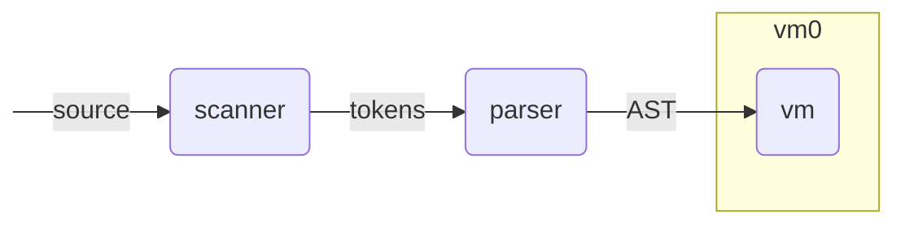

# vm0

vm0 is a virtual machine executing directly the syntax tree.

The execution is performed by walking the AST and evaluating each
visited node.

## Motivation

- have a reference execution model for each defined language
- usable for compilation time evaluation
- to modelize similar VMs (i.e. gnovm)
- to validate and compare with other VMs (once it is itself validated)
- could serve as a basis for AST based symbolic execution (to be
  investigated)
