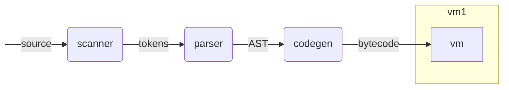

# vm1

`vm1` is bytecode based stack machine.

The purpose of `vm1` is to provide a simple, fast, embeddable and
portable Go execution environment.

The bytecode consists of a dozen of instructions, each taking 0 or 1
immediate argument (non-immediate arguments are only passed through the
stack). Only a few operators for a few types are implemented. I expect
to have 1 instruction per operator per numerical type, all with the same
pattern, which would be generated from a template. Estimate is around 20
operators and 10 numerical types, so around 200 instructions in final.

Structurally, the vm implements logical and arithmetic operators,
condional jumps for `if`, `for` and `switch` control flow, and function
call, return and frame management.

the memory state of the vm is a slice of Go interfaces (`[]any`).

The whole vm is coded in a single function of 80 lines with no
dependencies. The size will grow as we add missing instructions, but the
code complexity will remain the same.

the vm1 package is totally standalone and could be used for any purpose
outside of parscan and/or gno.
